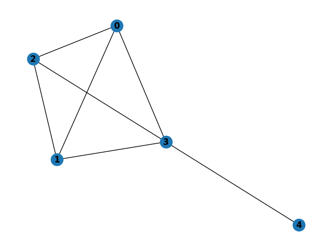

# GNNtutorial
A short (15 min) tutorial on Graph Neural Networks

A Jupyter Notebook to understand the basics of Graph Neural Networks. Just click on the `GNNtutorial.ipynb` above (A link to Colab is available inside).
It covers:
* creating a graph with networkx and a matrix of node features,
* how the GNN layer create embeddings and aggregate information at each node,
* Key properties and limitations of GNNs.

